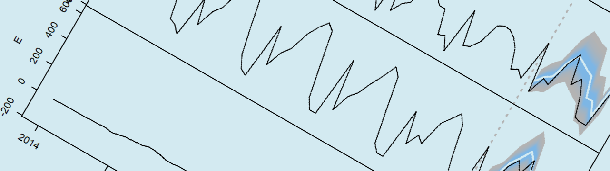
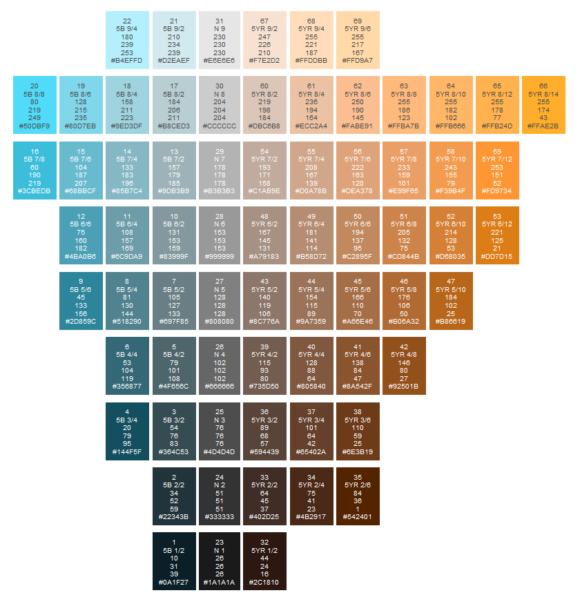

```{r include=FALSE}
library(knitr)
```

# Time Series



## Introduction to time series

In this workshop we will learn how to handle and visualize temporal data. Most analytic tools dealing with time series depend on the `ts` class of objects and so we will have to learn how to transform our source data to a `ts` object. After that, we will be plotting the results of some diagnostic and predictive analyses typical for time series data.

## Loading the time series data

At the end of the workshop you will have the opportunity to work with the same dataset as for the Boxplot workshop, but because that data is slightly more difficult to use for time series analysis, we will first start with a simpler dataset.

On [Kaggle](https://www.kaggle.com) you will find the dataset called [Time Series Data](https://www.kaggle.com/yugagrawal95/timeseries-data). The data is originally made available as an Excel workbook, but we will be using the same data converted into a `tsv` file. This dataset consists of the sales figures of a number of products along with several other variables that will not be used here.

> Excel is often very problematic as a data source, so if you can avoid it, preferably use a format that will still be understood 2000 years from now: plain text, preferably tab-separated values (`.tsv`) so that values with commas need not to be escaped with double quotes.

We use `data.table` to upload the data. This package currently offers the most professional way to manipulate data. The `fread` method is flexible and allows you to:

- load very fast and very large datasets
- parse text directly as data (i.e. `fread ("A,B\n1,2\n3,4")`)
- select variables as well as instances
- run a shell command to add a pre-processing step
- set the data type the variables should be interpreted as
- include the character encoding of a file (i.e. `UTF-8`)
- define the primary key in case of relational data
- directly open data from within an archive (i.e. `fread ("dev.gz")`)

1. In your new Rmd file, delete the sample code and add the code below (replace single quotes by backticks ([grave accents](https://en.wikipedia.org/wiki/Grave_accent))):

```yaml
---
title: "Timeseries"
author: "Your name here"
date: "Published on 'r Sys.Date()'"
output: 
  html_document: 
    highlight: zenburn
---
   
## Workshop Time Series
   
...
```

1. Enter in your name and replace `...` with a new R code block (eng: _code chunk_) using the shortcut `Ctrl + Alt + I`
1. Make sure in a rMarkdown file to add an empty line before and after each code block, title and list
1. Add the code below in this block (more details below):

```{r message=FALSE, warning=FALSE}
library(knitr)
library(data.table)
library(magrittr)
library(readxl)
library(dplyr)
library(ISOweek)
library(lubridate)
library(forecast)

opts_chunk$set(echo = TRUE)

sales <- fread("dat/sales.tsv")
```

With the various `library` expressions, the necessary packages are loaded into memory. If these lines generate an error, it usually means the package needs installing first. If so, use an expression such as `install.packages(c("data.table", "magrittr"))` in the console to install the missing packages. Let us now briefly review why we need these packages:

- `knitr`: parsing the RMarkdown to an HTML report
- `data.table`: loading and manipulating data
- `magrittr`: using [method chaining](https://en.wikipedia.org/wiki/Method_chaining)
- `dplyr`: alternative to manipulating data
- `ISOweek`: converting from date to week numbers and vice versa, according to [ISO 8601](https://en.wikipedia.org/wiki/ISO_8601) standards
- `lubridate`: expression of a date as a decimal number
- `forecast`: wrapper to run forecasts on `ts` objects

Note that for demo purposes two alternatives are used here for manipulating data. Also note that a lot of effort is put into manipulating date fields. As we will see, handling dates, especially when the data is classified on a weekly basis, can become very complex very rapidly.

With the `opts_chunk$set` function (actually function `set` that is an element of the `list` `opts_chunk`) we ensure that the source code is shown in the report. If the report is distributed to individuals who are not interested in the code, you can set `echo = FALSE`.

## Colors

1. Create a color palette:

```{r color-palette}
palette(c(rgb(.7, .7, .7), "steelblue1", "black", "#D3EAF1"))
```

The above code demonstrates the use of the color palette. Here you see that you can enter colors in different formats. After the palette has been defined, you can refer to the colors by means of their indices 1, 2, &hellip;.

If you haven't yet heard about it, you might want to examine the [Munsell color space](https://en.wikipedia.org/wiki/Munsell_color_system). Munsell was a genius with colors. A full description of his color space is beyond the scope of this workshop, but why not admire one of his so-called color contrasts (dyads):

```{r munsell, out.width="100%", echo=FALSE, fig.cap="(ref:munsell)"}

```

(ref:munsell) The dyad blue-5 versus yellow-red-5 (5B-5YR). In each colored box you will see from the top down: an index for reference, the Munsell color code, the corresponding RGB values and finally the color represented as a hex triplet. See the [Wikipedia page](https://en.wikipedia.org/wiki/Munsell_color_system) for more info and [this page](https://www.rit.edu/cos/colorscience/rc_munsell_renotation.php) of the Rochester Institute of Technology where you will find datasets to produce similar figures.

1. Try to use function `colorRampPalette` to make a gradient across sampling points corresponding to indices 20, 30 and 66 in above figure. Use `?colorRampPalette` if you have used this function before.

## Data exploration

We are going to keep data exploration here to a minimum.

1. With the `str` function you can 'look inside' objects such as this `sales` object. Such a function is typically executed in the console and is not part of the report itself:

```r
# In the console...
sales %>% str
```

```
## Classes 'data.table' and 'data.frame':   935 obs. of  86 variables:
##  $ Key                                              : chr  "A" "B" "C" "D" ...
##  $ Date                                             : POSIXct, format: "2014-01-01" "2014-01-01" ...
##  $ Volume                                           : num  1346974 677826 1210359 436761 434 ...
##  $ Disc                                             : num  4.29e+08 1.16e+08 1.04e+08 5.63e+07 2.94e+05 ...
##  $ max_T                                            : num  49.5 49.5 49.5 49.5 49.5 ...
##  $ min_T                                            : num  29.7 29.7 29.7 29.7 29.7 ...
##  $ avg_T                                            : num  39.6 39.6 39.6 39.6 39.6 ...
##  $ precipitation                                    : num  0.448 0.448 0.448 0.448 0.448 ...
##  $ Consumer_Price_Index_month                       : num  85.5 85.5 85.5 85.5 85.5 ...
##  $ Exchange_Rate_Index_Period_Average_month         : num  109 109 109 109 109 ...
##  $ Exchange_Rate_LCU_per_US_Period_Average_month    : num  6.83 6.83 6.83 6.83 6.83 ...
...
```

We see that there are a number of products (under `Key`), a date of sale (`Date`) and sales `Volume`. As you can see there are more variables, but with these three we should be able to get started and demonstrate the basics.

## Prepare data

The particular thing about time series (but also, for example, GIS data) is that the dependent variables do not only depend on other variables, but also on themselves. We speak of _autocorrelation_ when a value depends on a neighbouring value either through space or time.

1. To conduct a time series in R, you are best to work with `ts` class objects (stands for _time series_). In order to do that, we first need to pivot the data:

```{r sales-pivot}
sales <- sales %>%
  dcast(Date ~ Key, value.var = "Volume")
```

:::{.table-wrapper}

```{r sales-pivot-show, echo=FALSE}
sales %>% head %>% kable
```

:::

This pivoting of data is rather exceptional in statistical analyses and is mainly encountered in autocorrelated data (see also the term _repeated measures_).

1. Now we select three products and also apply a `Date` filter because some values are missing at the end of the time series. Then we convert the data to a `ts` object:

```{r sales-ts}
sales_ts <- sales[
  Date < "2020-02-01",    # Filter by date
  .(A, C, E)] %>%         # Select features
    ts(frequency = 12,    # Convert to ts, 12 months per year
      start = c(2014, 1)) # Provide start of the time series
```

The dot can have multiple meanings in R and this can be confusing at first. Here it stands as a synonym of `list`. Within a `magrittr`-pipe (i.e. after the `%>%`) the dot stands for _whatever is being passed on from previous step_, comparable to `ans` on scientific calculators. 

## Plotting time series

1. Once everything is in the correct format, it is as simple as calling the `plot` function:

```{r sales-plot-01}
par(bg = 4, cex.main = 1)

main <- "Sales figures\nfor three products"

sales_ts %>% plot(main = main, xlab = "Year")
```

Close, but no cigar. There is still an issue with the y-axes.

1. Try to think how to fix this issue before you continue. Then see below how it was fixed here.

The position of the labels on the axes in 'base R' is determined by a function `pretty`. So you could turn off the y-axes in the plot (`yaxt = "n"`) and plot them all manually using the `axis` function. Of course, it is much easier to divide the numbers by a factor 1000.

1. Adjust the previous code to divide the sales figures by 1000 and than adjust the title of the figure:

```{r sales-plot-02}
sales_ts_th <- sales_ts / 1000

par(bg = 4, cex.main = 1)

main <- "Sales figures (x1000)\nfor three products"

sales_ts_th %>% plot(main = main, xlab = "Year")
```

## Time series analyses

This is not a workshop on analyses, but in reality the analyses and the visualization go hand-in-hand. After all, visualization often serves as a diagnostics tool. Let us measure the amount of cross-correlation among the sales of our three selected products.

1. Examine the auto- and cross-correlation for all combinations of the sales volumes for the products A, C and E. Do this for a _horizon_ of 18 months in the future (positive) and in the past (negative):

```{r sales-plot-03}
par(bg = 4)
sales_ts_th %>% acf(lag.max = 18)
```

1. Take a quick look at `?acf` and then take a look at the left-most values on the subplots on the diagonal with titles __A__, __C__ and __E__. Why are these values 1?

From this we learn, for example, that there is a correlation between products A and E with a horizon of 1 'season' (1 year in this case), but that the relationship is not completely symmetrical. In other words one event seems to precede the other and that may be en important hint to analyse possible causal dependencies. To see this, compare the correlation at 1.0 for _A & E_ (below the dashed blue line indicating the significance level) with that of -1.0 for _E & A_ (above significance level).

## Decompose time series

1. Let us break the sales figures for one product, namely product C, into a seasonal effect (the purely repetitive part), the trend (background level) and the residual noise:

```{r sales-plot-04}
par(bg = 4)

sales_ts_th[, "C"] %>% stl(s.window = "periodic") %>% plot
```

Note that the problem of the axes is solved here by alternating the position of the y-axis.

1. Investigate how the plot of a `stl` object causes the axes to be displayed alternately, use `stats:::plot.stl`.

1. Did you notice the grey bars on the right in the figure above? Any idea what their function is?

## Predictions

Let us predict the future, more specifically the sales figures for the year 2019. Note that we already have those figures, so why would we predict them? Because it is of course good to immediately test the prediction against reality, otherwise we have to wait a year and the organizers of this workshop voted against :-).

1. Let us take the standard plot for multivariate `forecast` objects:

```{r sales-forecast, fig.height=7}
par(bg = 4)

sales_ts_th %>% forecast %>%
  plot(col = 3, xlab = "Year",
    main = "Items sold (x 1000)")
```

1. Before reading on, try to understand what the shaded areas are on the right?

The shaded areas on the right of the above figure correspond to the 80% and 95% prediction intervals. These are conceptually similar, _but not the same_, as confidence intervals.

1. Try to cut the chaining in above code chunk short and simply run `sales_ts_th %>% forecast`. How would you exploit this object to manually draw the prediction intervals?

The above figure is already quite good, but there are some issues still. Let us start with an important detail: the color and shades of the prediction intervals.

1. With `fan` you can obtain more color shades and with `colorRampPalette` we make a simple color gradient:

```{r sales-forecast-color, fig.height=7}
par(bg = 4)
ramp <- colorRampPalette(1:2)(25) 

sales_ts_th %>%
  forecast(fan = TRUE) %>%
  plot(col = 3, xlab = "Year", shadecols = ramp,
    main = "Items sold (x 1000)")
```

Now comes the main problem: we really only want to forecast only 2019 and we want to see the current and forecast data superposed. It would also be nice if there were a clear marking to demarcate the start of the prediction.

While the default plot is very useful already, there comes a time when we need to customize such graphs and this is exactly what we need to do here. We will create a `for` loop to draw the prediction-plot one at the time

1. Try to reproduce the predictions with the above requirements:

```{r sales-final}
par(bg = 4, mfrow = c(3, 1), oma = c(5, 3, 1, 1),
  mar = c(0, 4, 0, 2))

for (series_name in sales_ts %>% colnames) {
  series <- sales_ts_th[, series_name]
  fc <- series %>%
    window(end = c(2019, 1)) %>%
    forecast(fan = TRUE, h = 12)
  fc %>% plot(shadecols = ramp, col = 3,
    xaxt = "n", main = "")
  title(ylab = series_name)
  
  if (series_name == "E") {
    axis(1)
  }
  abline(v = 2019, lwd = 2, col = 1, lty = 3)
  fc <- series %>%
    window(start = c(2018, 12)) %>% lines(col = 3)
}

title(xlab = "Year", outer = 2)
```

Notice how for products A and C the actual sales remain mostly below the point estimate of of the predictions.

1. There is again an issue with the y-axis, try to fix it.

## Extra: Resampling temporal data

Temporal data is often organized on a weekly, monthly, quarterly, or annual basis. For example sales figures per quarter. In the industry we speak of a _bucket_ and the bucket could be a week, a quarter, etc &hellip;. Sometimes, however, as with the student data, a date field is provided, but the data is not neatly aggregated into fixed time units. The aggregation, which is also called _resampling_ or _bucketizing_, must then be performed manually. This is demonstrated below for the sake of completeness.

```{r herb-01}
sem_1 <- fread("dat/sem_1_anon.tsv")
```

We first check the range of the variable `Datum1`, divide it into weeks and add seven days to the end date:

```r
sem_1$Datum1 %>%
  range(na.rm = TRUE) %>%
  strftime("%Y-W%V-1") %>%
  ISOweek2date %>%
  add(c(0, 7))
```

By alternating the dot color per week, we can investigate where there is sufficient data available to perform an analysis on:

```{r herb-03, fig.height=7}
sem_1[, Week_T := factor(ISOweek(Datum1))]
week_lev_all <- sem_1$Week_T %>% levels
 
par(bg = 4)
ramp <- rainbow(24, 1)
temp_pal <- palette(ramp)

sem_1[, plot(Datum1, MemoS_T, col = Week_T,
  pch = 19, cex = .7,
  main = "Highlight weeks",
  xlab = "Date for review version\n('terugblikversie')",
  ylab = "Memorising")] -> d
 
legend("bottomright", legend = week_lev_all, col = ramp,
 cex = .7, bg = NA, ncol = 4, pch = 19, border = "n")

palette(temp_pal)
```

Finally, we can select the portion with sufficient data available and convert to a `ts` object:
 
```{r herb-04}
par(bg = 4)

sem_1[
  grepl("2020", Week_T),        # Selection
  .(MemoS_T = mean(MemoS_T)),   # Var-manipulation
  Week_T] %>%                   # Groeping
   arrange(Week_T) %>%          # dplyr
   select(MemoS_T) %>% 
   ts(
     freq = 365.25/7,
     start = decimal_date(ymd("2020-09-07"))) %>%
  plot(lwd = 2, xlab = "Tijd (decimaal)",
    ylab = "Memoriseren", main = "Evolutie memoriseren")
```
