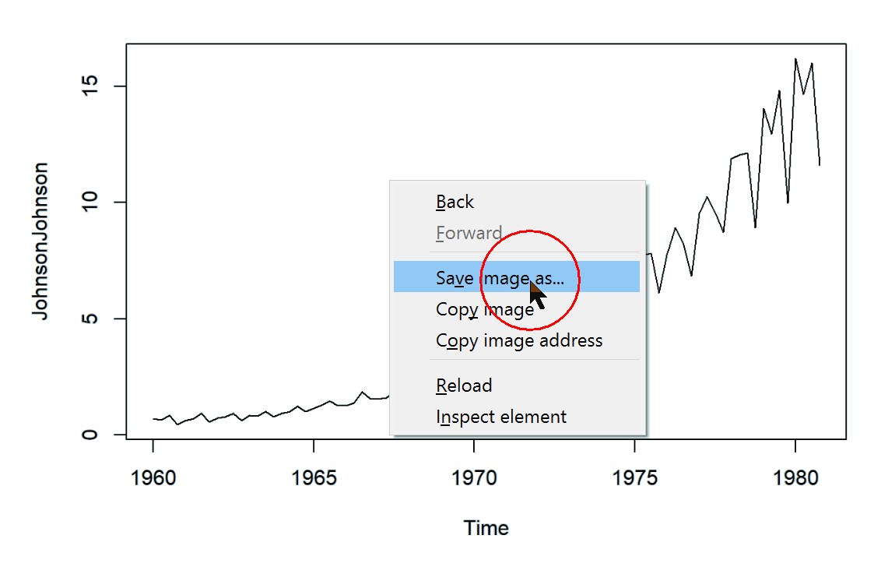
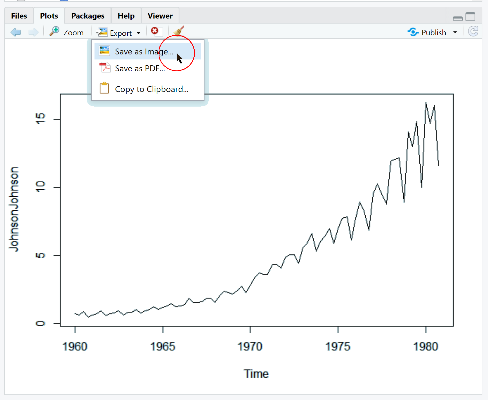
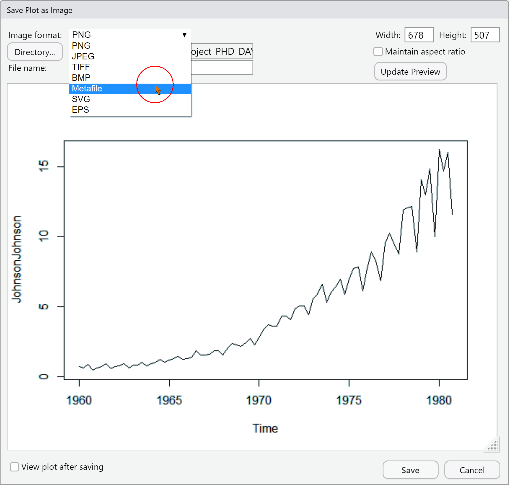
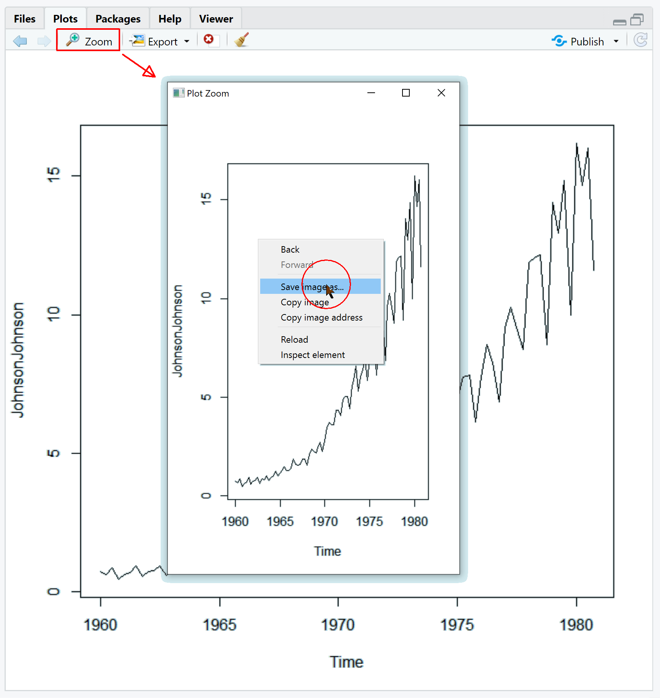

```{r echo=FALSE}
knitr::opts_knit$set(global.par = TRUE)
```

# Saving your plot

Let us conclude with a quickly overview on the number of ways one to persist a plot in R and RStudio. We will be first quickly drawing a plot:

```{r echo = FALSE}
par(bg = "#D2EAEF")
```

```{r}
plot(JohnsonJohnson)
```

## Using the Report

Simply right-click on the report to export the generated plot into a png file:



## Using RStudio's export function

If you plot from within the console, your plot will appear in teh _Plots_ tab.





Similarly you can use the _Zoom_ functionality:



## Programmatoricaly

Of course, there is also a way to export plot from within your script or notebook:

```{r eval=FALSE}
svg("img/J&J_Quaterly.svg", 300, 600)
plot(JohnsonJohnson)
dev.off()

jpeg("img/J&J_Quaterly.jpg", 300, 600)
plot(JohnsonJohnson)
dev.off()

tiff("img/J&J_Quaterly.tif", 300, 600)
plot(JohnsonJohnson)
dev.off()

png("img/J&J_Quaterly.png", 300, 600)
plot(JohnsonJohnson)
dev.off()
```

